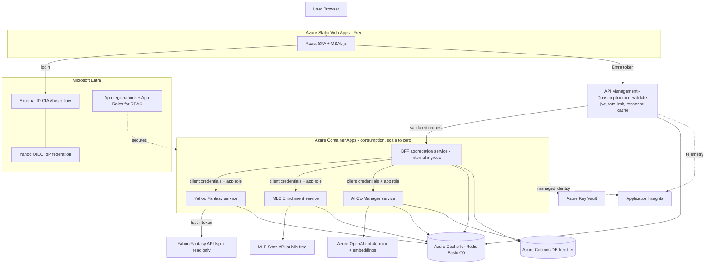

# Fantasy Baseball AI Co-Manager - Project Plan

> Plan of record. This file is the single source of truth for the build. Milestones (Foundation, M1-M7) are iterated separately via focused sub-plans that reference this file; each step is checked off here only once it is delivered (tested, deployed, verified).

A portfolio-grade full-stack app that exercises the exact stack in the target job description: React, Node.js, Azure AI Services, Microsoft Entra (External ID for users + app-to-app RBAC), M365 ecosystem, and optional Power Platform. Built as clean microservices with deliberate caching, scoped to stay under a one-time ~$100 Azure budget via scale-to-zero and free tiers.

## Core product behavior
- Users sign in with Yahoo (brokered by Entra External ID).
- They land in a ChatGPT-style chat with an AI "co-manager" plus screens to view league rosters and advanced stats.
- Chat answers questions like "any free agents who help me now?", "should I start player X?", "what trades should I pursue?" using their actual league context enriched with live MLB data.
- READ ONLY: app requests only Yahoo `fspt-r` scope and never calls write endpoints. The AI proposes moves; the user executes them in Yahoo.

## Critical design decision: two-token identity model
Entra External ID federation gives you Yahoo *sign-in*, but Entra issues its own tokens and does not pass through a usable Yahoo Fantasy API token. So we separate concerns:

1. App identity / session: Entra External ID (CIAM) user flow with Yahoo as a custom OIDC IdP (well-known endpoint `https://api.login.yahoo.com/.well-known/openid-configuration`). React uses MSAL.js; APIM validates the Entra access token at the edge via the `validate-jwt` policy (the BFF re-validates defensively).
2. Fantasy data access: after login, a one-time server-side "Connect your Yahoo Fantasy account" 3-legged OAuth grant with scope `fspt-r`. The resulting refresh token is encrypted and stored per user (Cosmos DB, key in Key Vault). The Yahoo service uses it to read league data.
3. App-to-app RBAC: each microservice is an Entra app registration with app roles; services authenticate to each other with the client-credentials flow and validate app roles. Azure resource access (Key Vault, Cosmos) uses Managed Identity.

## Access control (private allowlist)
The app is private to people you choose. Authorization is deny-by-default and enforced server-side (the Yahoo login alone is not sufficient, since any Yahoo account can authenticate).

- Primary gate - league auto-admit: after a user completes the Yahoo `fspt-r` connect, the Yahoo service reads their leagues and admits them only if they belong to an approved league. Match on the stable `league_id` (and the user's Yahoo `guid`), not a single season's `league_key` (which is season-scoped as `{game_key}.l.{league_id}`).
- Admin override: an allow/deny list keyed by Yahoo `guid` lets you explicitly grant access to someone outside the league or revoke someone in it. Deny always wins.
- Admin screen: an in-app admin area, gated by an Entra `admin` app role, to manage approved leagues, view connected users, and allow/deny individuals.
- Enforcement points: APIM rejects unauthenticated requests at the edge; the BFF enforces the allowlist on every request (authorized flag resolved at connect time and cached in Cosmos), returning a clear "request access" state for non-admitted users.
- Data minimization: store only what's needed to authorize (Yahoo `guid`, matched `league_id`, status); if a user is denied, do not retain their league/roster data.

## High-level architecture

## Azure resources (SKU / purpose / est. cost over build period)
- Azure Static Web Apps - Free tier - hosts React SPA, handles SPA routing/CDN - $0
- Azure API Management (Consumption tier) - edge gateway: `validate-jwt` Entra token check, rate limiting/quotas, response caching of common GETs, subscription keys for clean service boundaries - serverless, first ~1M calls/month free, ~$0 at this scale
- Azure Container Apps (Consumption, scale-to-zero) - runs the 4 Node microservices, internal ingress between services - mostly covered by monthly free grant, ~$0-10
- Azure Cosmos DB (Free tier, 1000 RU/s + 25GB) - user profiles, encrypted Yahoo refresh tokens, chat history, cached league snapshots - $0
- Azure Cache for Redis (Basic C0) - hot cache for rosters/free agents/MLB stats/AI context - ~$16/mo (optional; fallback to in-memory + Cosmos to hit $0)
- Azure OpenAI (gpt-4o-mini chat + text-embedding-3-small) - co-manager reasoning + lightweight retrieval - ~$5-15 with caching
- Azure Key Vault - Yahoo client secret + per-user token encryption key, accessed via Managed Identity - ~$0-1
- Application Insights / Log Analytics - tracing across microservices - ~$0-5 at low volume
- Container images - GitHub Container Registry (free) preferred over ACR Basic to save ~$5/mo - $0
- CI/CD - GitHub Actions deploying to Container Apps + Static Web Apps - $0
- Estimated total for the build window: well under $100 (roughly $25-50 with Redis on, near $0 without).

Intentionally out of budget: Azure AI Search (Basic ~$75/mo). We do lightweight retrieval in-app instead and note it as a future upgrade.

## Gateway split: APIM vs BFF (not redundant)
- API Management (edge): cross-cutting policy in config, not code - Entra `validate-jwt`, rate limits/quotas, edge response caching, CORS, subscription-key products per consumer. Single public ingress; backend Container Apps run with internal-only ingress behind it.
- BFF (domain): thin Node service for request aggregation/orchestration and shaping responses for the UI. Stays behind APIM.

## Microservices and abstractions
- BFF / aggregation: orchestrates calls to the 3 backend services and owns response aggregation for the UI (token validation is offloaded to APIM, re-checked defensively here).
- Yahoo Fantasy service: wraps the `yahoo-fantasy` npm library behind a clean `FantasyProvider` interface (read-only methods: getMyTeams, getLeague, getRoster, getFreeAgents, getPlayerStats). Handles token refresh via Yahoo callback.
- MLB Enrichment service: wraps `mlb-stats-api` behind a `StatsProvider` interface; merges live MLB stats/Statcast-style metrics onto Yahoo players by name/id mapping.
- AI Co-Manager service: a `ChatOrchestrator` that assembles a token-budgeted prompt from cached league context + enrichment, calls Azure OpenAI, and returns structured advice. Provider-agnostic `LLMProvider` interface so the model can be swapped.
- Typed contracts: a dedicated versioned `contracts` repo (published to GitHub Packages) holds all shared DTOs/types and the request/response schema for every inter-service boundary. Business objects are strongly typed end to end (no `any`/loose JSON across services), and each service depends on a pinned contracts version so changes are explicit and reviewable.
- Shared `auth` lib (also published) for Entra token validation + app-role checks, mirroring the "authorization abstractions for easy extension" pattern.
- Validate at the edges: parse/validate incoming payloads against the contract schema (e.g. Zod/TypeBox) at each service boundary so types are enforced at runtime, not just compile time.

## AI design: input size + caching discipline
- Context is pre-aggregated and cached, never fetched raw per message. The orchestrator pulls a compact "league context pack" (your roster, league free agents, opponents' rosters, key MLB stat deltas) from Redis/Cosmos and trims to a token budget before calling the model.
- Tiered cache TTLs by data volatility:
  - League metadata / settings: ~24h
  - Team rosters: ~15 min (or on demand)
  - Free agent pool: ~1h
  - MLB player stats: refreshed daily (and intra-day on game days)
  - AI "context pack" per team: rebuilt on roster/free-agent cache change
- Use gpt-4o-mini by default; optionally route harder multi-step reasoning (trade analysis) to a stronger model. Cache embeddings for player/league text to avoid recompute.

## Tech and libraries (confirmed current)
- Yahoo Fantasy: `yahoo-fantasy` (v5.x) Node wrapper, scope `fspt-r`, app registered on Yahoo Developer Network.
- MLB data: `mlb-stats-api` Node wrapper over the free public `statsapi.mlb.com` (no key required).
- Frontend: React + Vite + MSAL.js, a chat UI, and roster/stats views.
- Backend: Node.js + Fastify (or Express) per service, containerized.

## CI/CD and repo standards (polyrepo)
Each service lives in its own GitHub repo (frontend, BFF, Yahoo service, MLB service, AI service, a `contracts` repo for shared DTOs/types published to GitHub Packages, and an `infra` repo for Bicep/Terraform). Every repo gets the same baseline so they stay consistent without coupling.

Per-repo GitHub Actions pipeline (PR + main):
- PR checks: install, lint, typecheck, unit tests with a coverage gate (fail under threshold), `npm audit`, and CodeQL/secret scanning.
- Build: build the container image, tag with commit SHA, push to GitHub Container Registry (free); frontend builds the static bundle.
- Deploy: on merge to main, deploy backend images to Azure Container Apps (revision per SHA) and the frontend to Static Web Apps, authenticating to Azure via OIDC federated credentials (no stored cloud secrets). APIM/infra changes flow through the `infra` repo.
- Consistency: shared logic factored into a reusable workflow (a central `.github` repo) so each service references it rather than copy-pasting.

Cross-cutting safeguards baked into every repo:
- Branch protection: required PR review + green checks before merge.
- Dependabot for dependency updates.
- Secrets only via GitHub Actions secrets / Azure Key Vault + OIDC; never committed.
- A `.cursor/rules/engineering-principles.mdc` (alwaysApply) so the AI agent follows the same standards in each repo (see below).

## Global agent instructions
A focused set of `.cursor/rules/*.mdc` files is committed to every repo (one concern per rule, per Cursor best practice):
- `engineering-principles.mdc` (alwaysApply) - ask-first / no assumptions / human review, minimal code, clean separation of concerns, no new abstractions without strong justification, and risk/blast-radius/cost/performance/usability analysis before changes.
- `security.mdc` (alwaysApply) - never leak secrets or user data, secrets only from Key Vault/env, READ-ONLY Yahoo (`fspt-r`), least-privilege cross-service calls via Entra app roles.
- `testing.mdc` (globs `**/*.{ts,tsx}`) - high unit-test coverage, edge/failure-path tests, never weaken the coverage gate.
- `typed-contracts.mdc` (globs `**/*.ts`) - strongly-typed business objects, versioned shared DTOs at every boundary, runtime validation.
- `documentation.mdc` (alwaysApply) - concise docs, comment intent/trade-offs only.

## Optional Power Platform / M365 hook (kept out of core)
A Power Automate scheduled flow that warms the daily cache and emails a weekly "waiver wire digest" via Outlook/M365 - demonstrates Power Platform + M365 without polluting the core app.

## Phased roadmap
See "Implementation breakdown (UI-first)" below for the concrete sequence: a Foundation step (repos, contracts, rules, CI/CD) followed by milestones M1-M7, starting with the UI experience on mock data and swapping in real services behind the same DTOs.

## Process: plan of record
- This plan is the single source of truth for the build.
- We work UI-first and iterate milestone by milestone. For each milestone the agent spawns a new, focused child plan that references this file, then checks off the corresponding step here as it completes.
- Definition of delivered (Done): a step's concerns are implemented, unit-tested (coverage gate passing), deployed to Azure, and verified working end to end. Nothing is "done" until it is tested, deployed, and verified.

## Foundation (precedes milestones)
- Create polyrepo structure including the versioned `contracts` package.
- Author the `.cursor/rules/*.mdc` set.
- Set up baseline per-repo GitHub Actions (lint, typecheck, unit tests + coverage gate, npm audit, CodeQL/secret scan, build+push to GHCR, deploy via Azure OIDC) with branch protection + Dependabot.

## Implementation breakdown (UI-first)
Each milestone below is an independent unit of delivered work. Earlier milestones use mock data so the UX is validated first, then real services are swapped in behind the same DTOs.

### M1 - UI experience shell (mock data)
- Scaffold React + Vite + TypeScript app; base layout, routing, theming.
- Build the ChatGPT-style chat UI (message list, input, streaming-style rendering) against a mock chat responder.
- Build roster view and advanced-stats view against mock league/player data shaped to the `contracts` DTOs.
- Stub sign-in and "Connect Yahoo" screens (no real auth yet), plus a "request access / not authorized" state and a stubbed admin screen.
- Deploy to Static Web Apps; verify the full experience clickable end to end.

### M2 - Identity and access
- Create Entra External ID tenant; add Yahoo as custom OIDC IdP; build user flow.
- Wire MSAL.js login in the React app; gate the app behind sign-in.
- Stand up APIM (Consumption) with `validate-jwt`; route to a hello-world BFF on Container Apps (internal ingress).
- Verify: real login works, unauthenticated requests are rejected at the edge.

### M3 - Yahoo data (read-only) + access control
- Build the Yahoo Fantasy service behind `FantasyProvider`; implement the `fspt-r` connect flow; encrypt/store refresh token (Cosmos + Key Vault).
- Enforce the private allowlist: on connect, resolve league auto-admit (approved `league_id`) + admin override (Yahoo `guid`), persist the authorized flag, and have the BFF deny-by-default on every request.
- Build the admin screen (Entra `admin` app role) to manage approved leagues and allow/deny users.
- Build the BFF aggregation endpoints; replace roster/stats mock data with live Yahoo data.
- Verify: an in-league user is admitted automatically, a non-approved Yahoo account is blocked, and admin allow/deny overrides work.

### M4 - MLB enrichment
- Build the MLB service over `mlb-stats-api` behind `StatsProvider`; add Yahoo<->MLB player reconciliation.
- Merge live MLB stats into the stats views via the BFF.
- Verify: advanced stats reflect current MLB data for rostered players.

### M5 - AI co-manager
- Build the AI service `ChatOrchestrator`; assemble the token-budgeted context pack; integrate Azure OpenAI (gpt-4o-mini).
- Replace the mock chat responder with the real co-manager; persist chat history in Cosmos.
- Verify: chat gives league-aware, read-only advice grounded in the user's actual team.

### M6 - Caching and hardening
- Add tiered caching (Redis or in-memory fallback) and the context-pack rebuild triggers.
- Add APIM response caching for common GETs, rate limits/quotas, and full observability in App Insights.
- Verify: measurable latency/cost reduction; load behaves within budget.

### M7 - Optional Power Platform + polish
- Optional Power Automate scheduled cache-warm + weekly waiver-wire M365 email.
- Final docs, cost alerts, and portfolio write-up.

## Key risks / assumptions
- Yahoo OIDC federation in Entra External ID is supported (GA), but the Yahoo Fantasy data token must be obtained via the separate `fspt-r` grant described above.
- Redis Basic C0 is the main recurring cost; if budget is tight we fall back to in-memory + Cosmos caching for $0.
- Player identity mapping between Yahoo and MLB Stats API requires a small reconciliation layer (name + team + position).
- Budget interpreted as ~$100 one-time for the build window; resources chosen to scale to zero so idle cost is near $0.
